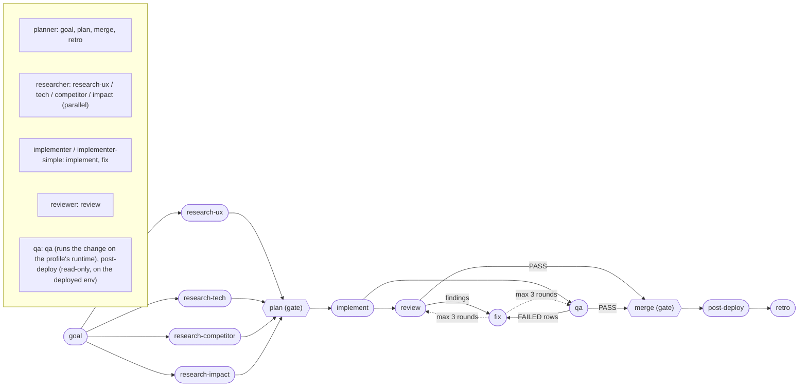

# graph-engineering

An AI-native software organization as a Claude Code plugin: a roster of agents, a
library of competencies, and playbooks that put them to work. Installed once,
updated from one repo, reused across every project.


## What it is

Four layers, each replaceable without touching the others:

```
COMPETENCIES (skills)   routed per task by the profile's routing table
        |
ROSTER (agents)         reused by every playbook
        |
PLAYBOOKS (graphs)      feature | bug | infra
        |
ENGINE (/graph-ship)    playbook-agnostic: run nodes, honor gates, keep a ledger
```

The engine does not know what a feature is. It reads a playbook and runs the
nodes it finds, which is why a bug workflow and an infra workflow are new
markdown files rather than new branches in the engine.

Three playbooks ship: `feature`, `bug` and `infra`. The feature playbook:




Gates (`plan`, `merge`) stop and wait for the owner. The engine derives each
node's REQUIRED skills from the profile's routing table matched against the
task's files - the agent never chooses its conditional skills.

Review reads the diff; qa runs it. The qa node stands the repo up from the
profile's `runtime` block, runs the PR's Bruno suite, Schemathesis and browser
flows against it, and its `FAILED` rows go into the same fix loop as review findings. A qa leg
that could not run (`BLOCKED`) keeps the merge gate closed.

## Install

```
/plugin marketplace add ShonP/graph-engineering
/plugin install graph-engineering@graph-engineering
```

User scope. Updates arrive with `/plugin update`.

## Develop

```
claude --plugin-dir ~/projects/graph-engineering
```

Loads the working copy for that session with no install step, additively
alongside your installed plugins, and takes precedence over an installed plugin
of the same name. Edit, restart, test. No commit needed.

**Releasing:** bump `version` in `.claude-plugin/plugin.json` with every push
you want installs to pick up - `claude plugin update graph-engineering` compares
versions, not commits, and reports "already at the latest version" when the
number has not moved. Updating is a CLI command; the `/plugin` menu has no
update option. If update still reports the old version, refresh the marketplace
cache first:

```
claude plugin marketplace update graph-engineering
claude plugin update graph-engineering
```

Then restart the session to apply.

## Use

```
/graph-init            # once per repo: writes .claude/graph-profile.yaml
/graph-ship "<goal>"   # triage picks feature, bug or infra, then runs it
/graph-ship "<goal>" --graph bug   # or name the playbook yourself
```

Triage writes its pick and the reason as the first line of the run's ledger;
the owner sees it at the first gate.

| Playbook | Shape | For |
|---|---|---|
| `feature` | goal -> research ux / tech / competitor / impact -> **plan gate** -> implement -> review ∥ qa -> fix (≤3) -> **merge gate** -> post-deploy -> retro | new behaviour, chores, mixed app + infra |
| `bug` | report -> reproduce (a **failing test**, by qa) -> diagnose (`systematic-debugging`) -> sibling search (same bug shape elsewhere, Semgrep) -> **plan gate** -> implement -> review ∥ qa -> fix -> **merge gate** -> post-deploy -> retro | existing behaviour that is wrong |
| `infra` | goal -> research tech / impact -> **plan gate** -> implement -> review ∥ verify (render, validate CRDs too, rendered diff, apply to a throwaway cluster) -> fix -> **merge gate** -> post-deploy -> retro | Helm, kustomize, Argo CD, manifests, gateway and policy config |

`/graph-ship --resume <run-id>` picks a run back up from its ledger.
`/graph-ship --auto-merge` relaxes only the merge gate, only for that run.

## Hooks

Installing this plugin turns on three hooks, and they run your repository's own
scripts. Read this before enabling it on a repo you did not write.

| When | What runs | If it is unhappy |
|---|---|---|
| after every `Edit` or `Write` | your `lint`, then your `typecheck`, on the file just touched | nothing is blocked. The output comes back to Claude as context beside the tool result |
| before Claude stops | your whole `test` script | the turn is blocked with exit 2 and Claude keeps working until the suite is green, or until Claude Code ends the turn after 8 consecutive blocks (hooks reference, "Stop input") |
| at session start | the first 40 lines of `docs/HANDOFF.md`, when that file exists | nothing |

The edit hook acts only on a real file strictly inside `$CLAUDE_PROJECT_DIR`, so
an edit inside a scratch clone of somebody else's repo never runs that repo's
scripts. The stop hook looks in the project root and nowhere else. Neither runs
anything unless your repo declares the script under one of three conventions
(`pyproject.toml`, `package.json`, `Taskfile.yml`), so a repo with none of them
sees no change at all.

Two costs to know before you install. A suite that is red for reasons unrelated
to the current task blocks up to 8 turns, running your full test command each
time; and a slow suite is paid on every stop. To turn them off, disable the
plugin with `claude plugin disable graph-engineering`, or every hook in a scope
with `"disableAllHooks": true` in that scope's settings file (hooks reference,
"Disable or remove hooks").

Detection order, the project-directory bound, the dependency list and the test
command: [`hooks/README.md`](hooks/README.md).

## Roster

The full organization - seven agents, engineering only:

| Agent | Model | Job | Writes |
|---|---|---|---|
| `planner` | fable | spec, then task-decomposed plan with per-task sizing | specs only |
| `researcher` | sonnet | one bounded question, five modes: ux / tech / competitor / impact (blast radius + adjacent-issue triage) / spike (strict turn budget) | reports only |
| `ux-designer` | sonnet | experience spec before implementation; variant exploration scored against the house rubric | mockups only |
| `implementer` | opus | one non-trivial task, test-first, with spine-named skills | yes |
| `implementer-simple` | sonnet | one SMALL task (mechanical, 1-2 files); escalates instead of pushing through | yes |
| `reviewer` | opus | reads the diff once through every lens it needs | no (read-only) |
| `qa` | sonnet | acceptance criteria verified on a RUNNING system, evidence per criterion | tests only |

The model column is the agent's frontmatter and the engine dispatches it unchanged: `/graph-ship` never passes a `model:` override, so a scoped re-check of a three-line fix runs on the same opus reviewer as the first review. Implementer versus implementer-simple, by task size, is the engine's only model choice.

The engine picks the implementer by the task's `size` in the plan: `small` goes
to `implementer-simple`, everything else to `implementer`. Every agent below its
skill floor returns `NEEDS_SETUP` instead of improvising.

Still planned: board sync and `/graph-doctor`.

## Competencies

Skills live under `skills/<group>/<name>/SKILL.md`. The group is filing only; what
routes a skill to a task is the profile's routing table, matched against the
task's files. The directory name is the routing name, and
`scripts/check-skill-frontmatter.sh` enforces that the frontmatter `name` agrees
with it, and `scripts/check-routing-resolves.sh` checks that every name the
routing table and the roster reference actually resolves to one skill.

| Group | Skills | Routed by |
|---|---|---|
| `ios` | swiftui-pro, healthkit, widgetkit, activitykit, photokit, push-notifications | `**/*.swift`, plus dir globs per framework |
| `android` | compose-state, compose-ui, compose-performance, compose-build-and-test, kotlin-concurrency, kotlin-control-flow, kotlin-functions, kotlin-types-value-class | `**/*.{kt,kts}` |
| `react` | react-rules, tanstack-query-rules, tanstack-router | `**/*.{ts,tsx}` |
| `supabase` | supabase, supabase-postgres-best-practices | `**/*.sql` |
| `python` | uv, pydantic, pydantic-house-rules, fastapi, building-pydantic-ai-agents, pydantic-ai-harness | `**/*.py`, `**/{pyproject.toml,uv.lock,.python-version}`; building-pydantic-ai-agents on `**/agents/**/*.py`; pydantic-ai-harness by the agent catalogs only, no routing row |
| `agents` | microsoft-agent-framework | `**/agents/**/*.py` |
| `k8s-gitops` | argocd, helm, kubectl, kustomize, cloudnativepg, envoy-gateway, agent-router, sops-age | `argocd/**`, `manifests/**`, `**/Chart.yaml`, `**/kustomization.{yaml,yml}`, `**/*.enc.yaml` |
| `temporal` | temporal-developer | `**/{workflows,activities}/**/*.py` |
| `qa` | playwright-cli, playwright-trace, playwright-component-testing, bruno, schemathesis | `tests/**/*.spec.ts`, `playwright.config.ts`, `**/*.bru`; bruno and schemathesis also on every API-surface row |
| `observability` | promql, loki, tempo | `observability/**`, `**/dashboards/**/*.json`, `**/*rule*.{yaml,yml}` |
| `security` | security-review | `always.review` |
| `privacy` | privacy-review, gdpr-consent, gdpr-erasure-retention | `always.review`, `**/{migrations,schemas}/**` |
| `ux` | ux-journey, ui-ux-pro-max | `always.design` |
| `process` | prior-art, review-protocol, ux-evidence, api-contract, definition-of-done, impact-map, product-spec, qa-verification | prior-art on `always.impl`, review-protocol on `always.review`, definition-of-done and impact-map preloaded in agent frontmatter (planner and both implementers; reviewer: definition-of-done) and deliberately not in `always`, ux-evidence on every UI-bearing row, api-contract on every API-surface row (`routers/`, `controllers/`, `handlers/`, OpenAPI specs, `*.bru`); product-spec preloaded by `planner`, qa-verification preloaded by `qa` |
| `rules` | backend-rules, frontend-rules, architecture-resilience-rules, agent-workflow-rules, review-testing-rules | ride along on their stack's rows; `review-testing-rules` is on `always.impl` |

**Provenance.** Some of these are written here from the vendor's own docs; some
are vendored from upstream. A vendored tree carries a `SOURCE.md` naming the
upstream repo, the pinned commit, the license, and a copy-paste refresh recipe,
plus the upstream `LICENSE` (and `NOTICE` where the license requires it). A
vendored file is never edited, not even to fix it: a house rule that contradicts
one lives in a sibling skill, which spec 4.5 precedence (house >
vault-generated > community) makes win. `skills/python/pydantic-house-rules` is
the worked example.

**One thing to set on the host.** The vendored Playwright skills declare
`allowed-tools: ... Bash(npx:*) Bash(npm:*)`, and `npx <package>` fetches and
runs arbitrary registry code. A skill's `allowed-tools` applies whenever that
skill is active, and per [Configure
permissions](https://code.claude.com/docs/en/permissions) "workspace trust never
gates a skill's allowed-tools in any session". A sibling house-rules skill cannot
narrow it either, because `allowed-tools` only applies while its own skill is
active. The control that binds is a permission rule in the consuming repo's
`.claude/settings.json`: per [Extend Claude with
skills](https://code.claude.com/docs/en/skills), "a matching ask or deny rule
still aborts the invocation regardless of `allowed-tools`":

```json
{ "permissions": { "ask": ["Bash(npx:*)", "Bash(npm:*)"] } }
```

`ask` rules only restrict, so unlike `allow` rules they take effect without the
workspace trust dialog. `/graph-init` prints this whenever it routes the QA row.

Plan for the consequence: with that rule in place the two Playwright skills
prompt on first use in an interactive session, and in a non-interactive run
(`claude -p`, CI) the invocation aborts with `Execute skill: <name>` and no
body. Pre-allow `Bash(npx:*)` and `Bash(npm:*)` on the runner, or pass
`--allowedTools`, wherever a headless run needs those two skills.

How each skill was sourced, and what was rejected:
`docs/superpowers/plans/2026-09-10-stack-skills.md` and
`docs/research/2026-09-10-stack-skills-sourcing.md`; for `ruff`, `sqlalchemy`,
`loguru` and `nats`, `docs/research/2026-09-23-python-skills-sourcing.md`.

## House rules

Some competencies are not routed by file type; they are the organization's
standing rules and every agent carries them:

- **UX evidence.** Every change a user can see ships before/after evidence -
  screenshot pairs for static changes, ≤30s recording pairs for flows - captured
  as code, committed under the profile's `uxEvidence.path` (default
  `docs/ux/changes`) and embedded in the PR body. The implementer captures
  *before* on the base commit, first, before touching UI. The reviewer treats a
  missing pair on a UI diff as Blocking. `skills/process/ux-evidence`.
- **API contract.** Every change to an API surface ships its Bruno requests in
  the same PR - happy path asserting values, auth, validation, edge, non-leak -
  under the profile's `api.collection`, with the served OpenAPI schema kept
  current. qa runs the requests, the whole collection, and Schemathesis (tests
  generated from the schema: the cases nobody wrote) against the disposable
  stack the profile's `runtime` block stands up. A 5xx or a response that breaks
  the schema blocks; spec drift is Important. The reviewer treats a missing
  suite on an API diff as Blocking.
  `skills/process/api-contract`.
- **Definition of done.** Every task is classified by change type - API,
  DB schema, infra, background job, UI, config/flag, dependency bump, AI
  agent/prompt - and its PR carries that type's artifacts beyond the code:
  tests, contract suite, migration with a down path, rendered-manifest diff,
  observability, docs, a rollback that was actually run. The planner stamps the
  cells into acceptance criteria, the reviewer checks them.
  `skills/process/definition-of-done`.
- **Impact map and the scout rule.** Before planning, the researcher's impact
  mode maps callers, contracts, infra and tests around the change and triages
  every adjacent issue: must-fix (a plan task), fix-in-PR (a small task, capped
  at 3 or 20% of the plan), follow-up (listed in the PR, not fixed). That is how
  related bugs get fixed without a two-hour fix becoming a two-day refactor.
  `skills/process/impact-map`.
- **After merge.** Every playbook ends with `post-deploy` - qa waits for the
  merged commit to serve, then runs the `smoke`-tagged Bruno requests and
  AnalysisTemplate-shaped PromQL checks against the deployed environment,
  read-only, and on FAIL hands the owner a filled-in rollback, never running it
  (`post-deploy-verification`) - and `retro`, a blameless leak table (what each
  gate caught, what got past the gate that should have) turned into proposed
  rule diffs the owner applies or declines (`retro`).
- **Prior art.** No ask starts from priors. At the start of every task, and
  again at every mid-task fork, look at what others do - reuse candidates
  first (an existing skill, plugin or library), then competitors, open source,
  docs, articles - rank each source, run the skepticism checklist, spike any
  load-bearing claim, and write the prior-art note. The feature graph opens
  with a four-way research MAP for this reason. `skills/process/prior-art`.
- **Security, privacy, accessibility** are implementer non-negotiables and
  always-on review lenses; see `agents/implementer.md` and
  `skills/process/review-protocol`.

## The profile is yours

`.claude/graph-profile.yaml` lives in your repo. A plugin update replaces agents,
skills and playbooks and never rewrites it. `localAgents` in that file makes the
engine defer to agents your repo already owns, so this plugin is additive rather
than a migration.

## Design

`docs/superpowers/specs/2026-08-31-graph-engineering-plugin-design.md` records
the decisions and, more usefully, what was rejected and why.
