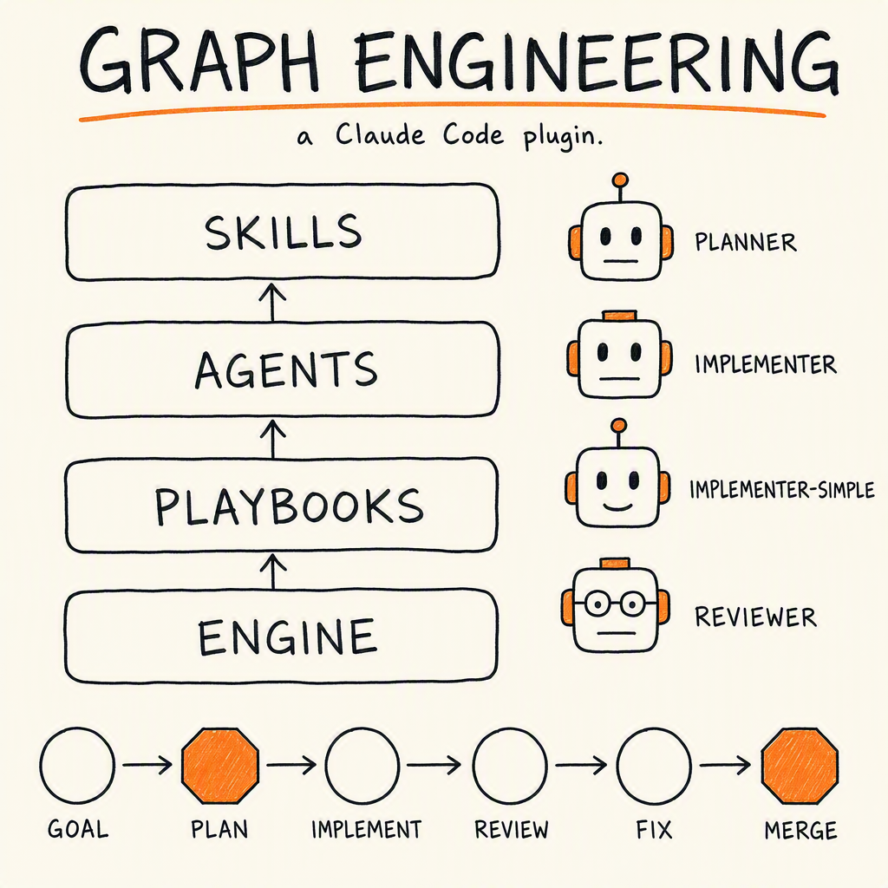
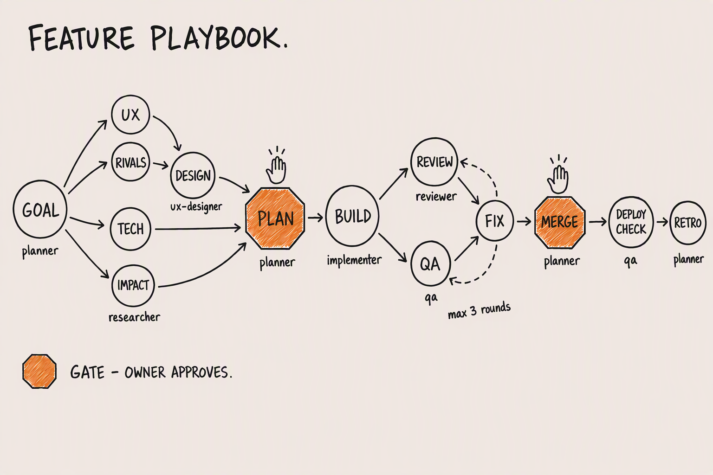
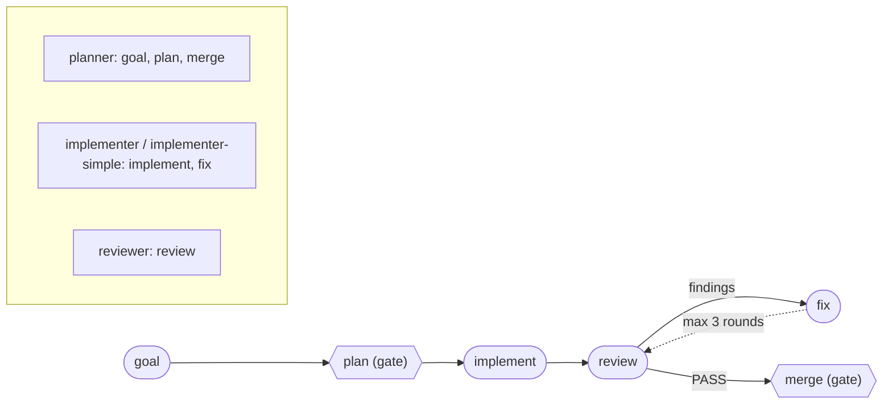

# graph-engineering

An AI-native software organization as a Claude Code plugin: a roster of agents, a
library of competencies, and playbooks that put them to work. Installed once,
updated from one repo, reused across every project.



## What it is

Four layers, each replaceable without touching the others:

```
COMPETENCIES (skills)   routed per task by the profile's routing table
        |
ROSTER (agents)         reused by every playbook
        |
PLAYBOOKS (graphs)      feature | bug | launch | content
        |
ENGINE (/graph-ship)    playbook-agnostic: run nodes, honor gates, keep a ledger
```

The engine does not know what a feature is. It reads a playbook and runs the
nodes it finds, which is why a bug workflow and a content workflow are new
markdown files rather than new branches in the engine.

The feature playbook, the only one shipped so far:





Gates (`plan`, `merge`) stop and wait for the owner. The engine derives each
node's REQUIRED skills from the profile's routing table matched against the
task's files - the agent never chooses its conditional skills.

## Install

```
/plugin marketplace add ShonP/graph-engineering
/plugin install graph-engineering@graph-engineering
```

User scope. Updates arrive with `/plugin update`.

## Develop

```
claude --plugin-dir ~/projects/graph-engineering
```

Loads the working copy for that session with no install step, additively
alongside your installed plugins, and takes precedence over an installed plugin
of the same name. Edit, restart, test. No commit needed.

## Use

```
/graph-init            # once per repo: writes .claude/graph-profile.yaml
/graph-ship "<goal>"   # run the feature playbook
```

`/graph-ship --resume <run-id>` picks a run back up from its ledger.
`/graph-ship --auto-merge` relaxes only the merge gate, only for that run.

## Roster

The full organization - nine agents:

| Agent | Model | Job | Writes |
|---|---|---|---|
| `planner` | fable | spec, then task-decomposed plan with per-task sizing | specs only |
| `researcher` | sonnet | one bounded question, four modes: ux / tech / competitor / spike (strict turn budget) | reports only |
| `ux-designer` | sonnet | experience spec before implementation; variant exploration scored against the house rubric | mockups only |
| `implementer` | opus | one non-trivial task, test-first, with spine-named skills | yes |
| `implementer-simple` | sonnet | one SMALL task (mechanical, 1-2 files); escalates instead of pushing through | yes |
| `reviewer` | opus | reads the diff once through every lens it needs | no (read-only) |
| `qa` | sonnet | acceptance criteria verified on a RUNNING system, evidence per criterion | tests only |
| `media-producer` | sonnet | short-attention media: 1.3s hook, ≤30-90s cuts, captions always, media built as code | assets only |
| `content-writer` | sonnet | short-attention copy grounded in the voice doc and real numbers; never publishes | copy only |

The engine picks the implementer by the task's `size` in the plan: `small` goes
to `implementer-simple`, everything else to `implementer`. Every agent below its
skill floor returns `NEEDS_SETUP` instead of improvising.

Still planned: the `bug`, `launch` and `content` playbooks that put the back
half of the roster to work, board sync, and `/graph-doctor`.

## The profile is yours

`.claude/graph-profile.yaml` lives in your repo. A plugin update replaces agents,
skills and playbooks and never rewrites it. `localAgents` in that file makes the
engine defer to agents your repo already owns, so this plugin is additive rather
than a migration.

## Design

`docs/superpowers/specs/2026-08-31-graph-engineering-plugin-design.md` records
the decisions and, more usefully, what was rejected and why.
