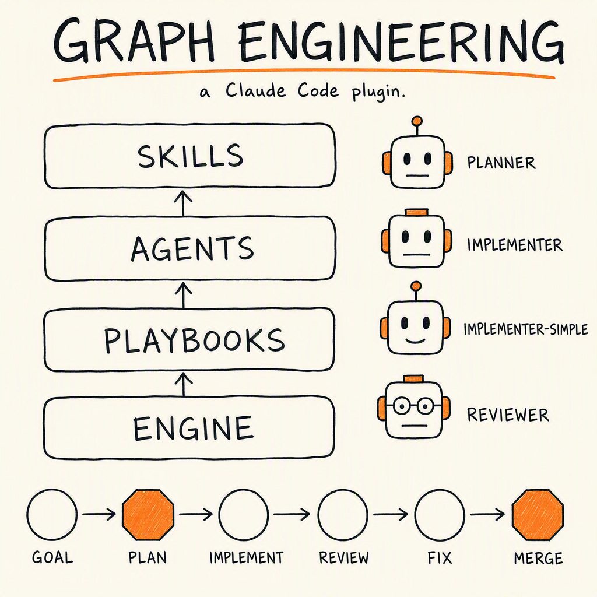
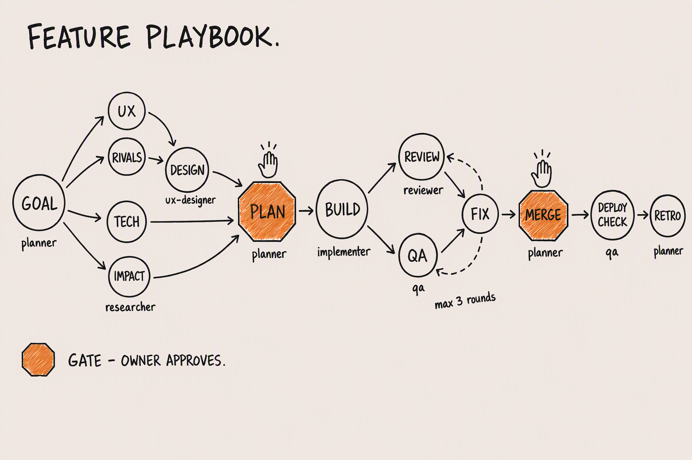
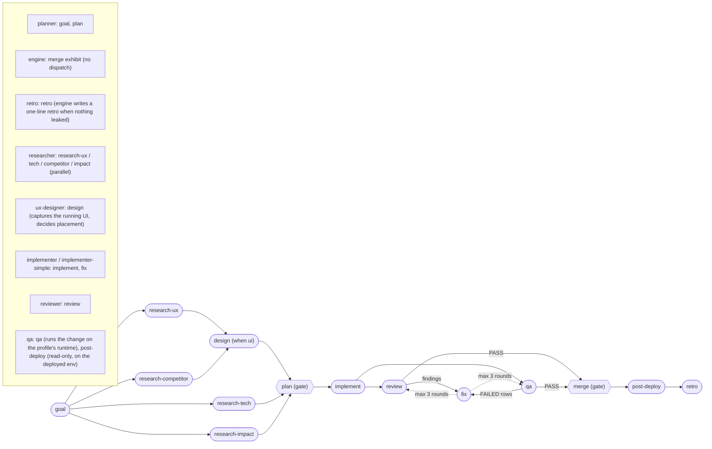

# graph-engineering

An AI-native software organization as a Claude Code plugin: a roster of agents, a
library of competencies, and playbooks that put them to work. Installed once,
updated from one repo, reused across every project.



## What it is

Four layers, each replaceable without touching the others:

```
COMPETENCIES (skills)   routed per task by the profile's routing table
        |
ROSTER (agents)         reused by every playbook
        |
PLAYBOOKS (graphs)      feature | bug | infra
        |
ENGINE (/graph-ship)    playbook-agnostic: run nodes, honor gates, keep a ledger
```

The engine does not know what a feature is. It reads a playbook and runs the
nodes it finds, which is why a bug workflow and an infra workflow are new
markdown files rather than new branches in the engine.

Four playbooks ship: `feature`, `bug`, `infra` and `quick` (the small-ask lane). The feature playbook:




```mermaid
flowchart LR
    goal([goal]) --> rux([research-ux]) & rtech([research-tech]) & rcomp([research-competitor]) & rimp([research-impact])
    rux & rcomp --> design(["design (when ui)"])
    design & rtech & rimp --> plan{{"plan (gate)"}}
    plan --> implement([implement])
    implement --> review([review]) & qa([qa])
    review -->|findings| fix([fix])
    qa -->|FAILED rows| fix
    fix -.->|"max 3 rounds"| review & qa
    review & qa -->|PASS| merge{{"merge (gate)"}}
    merge --> post([post-deploy]) --> retro([retro])

    subgraph agents [" "]
        direction LR
        a1["planner: goal, plan"]
        a6["engine: merge exhibit (no dispatch)"]
        a7["retro: retro (engine writes a one-line retro when nothing leaked)"]
        a0["researcher: research-ux / tech / competitor / impact (parallel)"]
        a5["ux-designer: design (captures the running UI, decides placement)"]
        a2["implementer / implementer-simple: implement, fix"]
        a3["reviewer: review"]
        a4["qa: qa (runs the change on the profile's runtime), post-deploy (read-only, on the deployed env)"]
    end
```

Gates (`plan`, `merge`) stop and wait for the owner. When the goal changes
anything a user sees, `design` runs first: the ux-designer captures the
screens as they run now, decides where each new element goes and why (against
what the app already does, with the alternatives that lost), renders the
decision, and writes UI acceptance rows. The plan embeds it, so the plan gate
is where the owner approves the design; implementer, reviewer and qa are held
to it. The engine derives each
node's REQUIRED skills from the profile's routing table matched against the
task's files - the agent never chooses its conditional skills.

Review reads the diff; qa runs it. The qa node stands the repo up from the
profile's `runtime` block, runs the PR's Bruno suite, Schemathesis and browser
flows against it, and its `FAILED` rows go into the same fix loop as review findings. A qa leg
that could not run (`BLOCKED`) keeps the merge gate closed.

## Install

```
/plugin marketplace add ShonP/graph-engineering
/plugin install graph-engineering@graph-engineering
```

User scope. Updates arrive with `/plugin update`.

## Develop

```
claude --plugin-dir ~/projects/graph-engineering
```

Loads the working copy for that session with no install step, additively
alongside your installed plugins, and takes precedence over an installed plugin
of the same name. Edit, restart, test. No commit needed.

**Releasing:** bump `version` in `.claude-plugin/plugin.json` with every push
you want installs to pick up - `claude plugin update graph-engineering` compares
versions, not commits, and reports "already at the latest version" when the
number has not moved. Updating is a CLI command; the `/plugin` menu has no
update option. If update still reports the old version, refresh the marketplace
cache first:

```
claude plugin marketplace update graph-engineering
claude plugin update graph-engineering
```

Then restart the session to apply.

## Use

```
/graph-init            # once per repo: writes .claude/graph-profile.yaml
/graph-init --upgrade  # moves an existing profile to schema v2; shows the diff first
/graph-doctor          # read-only setup check, one fix per finding
/graph-ship "<goal>"   # the router picks a lane and a playbook, then runs it
/graph-ship "<goal>" --graph bug   # or name the playbook yourself
/graph-ship "<goal>" --lane quick  # or the lane
```

The router sizes each ask into one of five lanes: `answer` (no code), `direct`
(one small diff, at most 2 files, one `implementer-simple`, no run dir),
`quick` (`graphs/quick.md`, at most 5 files), `full` (the playbook the ask type
picks) and `spike`. Any match against the profile's `risk:` table forces at
least `quick`. The lane, the matched risk rows, the playbook and the reason are
the first line of the run's ledger; the owner sees them at the first gate.

| Playbook | Shape | For |
|---|---|---|
| `feature` | goal -> research ux / tech / competitor / impact -> design (UI goals: placement in the running app) -> **plan gate** -> implement -> review ∥ qa -> fix (≤3) -> **merge gate** -> post-deploy -> retro | new behaviour, chores, mixed app + infra |
| `bug` | report -> reproduce (a **failing test**, by qa) -> diagnose (`systematic-debugging`) -> sibling search (same bug shape elsewhere, Semgrep) -> **plan gate** -> implement -> review ∥ qa -> fix -> **merge gate** -> post-deploy -> retro | existing behaviour that is wrong |
| `infra` | goal -> research tech / impact -> **plan gate** -> implement -> review ∥ verify (render, validate CRDs too, rendered diff, apply to a throwaway cluster) -> fix -> **merge gate** -> post-deploy -> retro | Helm, kustomize, Argo CD, manifests, gateway and policy config |
| `quick` | intake -> impact -> design (UI goals only) -> **plan gate** (goal and plan as one exhibit) -> implement -> review ∥ qa -> fix (≤3) -> **merge gate** -> post-deploy -> retro | a defined intent on at most 5 files, or any risk-row match on a small ask |

`/graph-ship --resume <run-id>` picks a run back up from its ledger.
`/graph-ship --auto-merge` relaxes only the merge gate, only for that run.
A repo can opt risk classes into auto-merge on full green with
`gates.auto_classes` (no blocking or important findings left, qa a full PASS,
`verify` green, no class in `gates.owner_classes`); the template ships `[]`, so
the owner merges everything until the repo opts in. `integration: pr |
push-main` picks how approved work lands.

`graph-control status --line` prints a status line that costs no tokens and
lists the live subagents per `<run8>:<node>`, with model and idle age; plain
`graph-control status` adds NEEDS YOU decision cards and cost by agent type.

## Hooks

Installing this plugin registers six hooks. The two that run your repository's
own commands (lint and test) are opt-in: they do nothing until the repo commits
`.claude/graph-checks.json` (copy `templates/graph-checks.json` and edit the argv
lists). Read this before enabling it on a repo you did not write.

| When | What runs | If it is unhappy |
|---|---|---|
| after every `Edit` or `Write`, async | `lint.argv` from `graph-checks.json` on the file just touched, only for a listed extension | nothing is blocked. Findings arrive on the next turn |
| before a `Bash` command that pushes, removes a remote, runs `rm` or `docker` | the destructive-command guard (a bash filter; python only on a match) | Claude Code asks the owner, showing the evidence it gathered (force push without a lease, remote removal, Docker volume delete, recursive `rm` of a protected path). It never denies |
| before an `Agent` call | the policy guard, only when the profile has a `policy:` block | `general-purpose` and `policy.never` models are denied; each role runs on its `policy.roles` tier; a `policy-override: <reason>` line in the prompt skips it and is logged |
| after Claude stops, `asyncRewake` | `test.argv` from `graph-checks.json`, after an optional `precheck` | Claude is woken with the failure, at most once per prompt. A precheck failure or timeout reports "not verified" and does not wake it. An unchanged tree replays its stored verdict instead of rerunning; `GRAPH_CHECKS_NO_MEMO=1` turns that off |
| at session start (`startup`, `clear`, `compact`) | the first 40 lines of `docs/HANDOFF.md`, when that file exists, and the reply contract when the repo has a profile; silent on resume, fork and `--agent` sessions | a warning line when `HANDOFF.md` is over 150 lines |
| at session start (`startup` only, cached) | the doctor's quick checks | up to 3 finding lines, or a `/graph-init` hint in a git repo with a stack marker and no profile; silent when clean |

**0.15 breaks 0.14 autodetect.** The `pyproject.toml`, `package.json` and
`Taskfile.yml` script lookups are gone; a repo that relied on them adds
`.claude/graph-checks.json` to keep the Stop gate and the lint.

To turn the hooks off, disable the plugin with `claude plugin disable
graph-engineering`, or every hook in a scope with `"disableAllHooks": true` in
that scope's settings file (hooks reference, "Disable or remove hooks").

The `graph-checks.json` contract, version floors and the rationale for each
handler: [`hooks/README.md`](hooks/README.md).

## Roster

The full organization - eight agents, engineering only:

| Agent | Model | Job | Writes |
|---|---|---|---|
| `planner` | opus | spec, then task-decomposed plan with per-task sizing | specs only |
| `researcher` | sonnet | one bounded question, five modes: ux / tech / competitor / impact (blast radius + adjacent-issue triage) / spike (strict turn budget) | reports only |
| `ux-designer` | opus | the `design` node: captures the running UI, decides placement, shows it in the best-suited available medium (live-app capture, Storybook, HTML, Claude artifact, Claude Design), writes the experience spec with UI acceptance rows; variant exploration scored against the house rubric | mockups only |
| `implementer` | opus | one non-trivial task, test-first, with spine-named skills | yes |
| `implementer-simple` | sonnet | one SMALL task (mechanical, 1-2 files); escalates instead of pushing through | yes |
| `reviewer` | opus | reads the diff once through every lens it needs | no (read-only) |
| `qa` | sonnet | acceptance criteria verified on a RUNNING system once per merge unit or wave, evidence per criterion; rows end `VERIFIED`, `FAILED` or `BLOCKED`, the verdict is `PASS`, `FAIL INCOMPLETE: <row ids>` or `INCOMPLETE: <row ids>`, and findings go to `qa-findings.json` | tests only |
| `retro` | sonnet | the `retro` node when a finding leaked past its gate: leak table and proposed rule diffs, never applied | `retro.md` only |

The model column is the default tier in the agent's frontmatter. The profile's
`policy:` block is the single source of tiers: the engine passes
`model: <policy.roles tier>` on every dispatch, and the `guard-agent` hook
rewrites any roster call to its role's tier. Never haiku, never fable, never
`general-purpose`. Review never drops to a cheaper tier; the only move is up:
fix round 3 escalates a small task from `implementer-simple` to `implementer`.
`implementer` (200), `implementer-simple` (60), `qa` (250) and `retro` (40) carry
a frontmatter `maxTurns` cap. Children return at most 1,500 tokens plus artifact
paths; the reviewer writes `findings.json` (schema v1 in `review-protocol`, a
route on every finding) and ends with one `PASS|CHANGES-REQUESTED ... findings=<path>`
verdict line. `graph-control depth` sets the review depth (`lint`, `single`
or `panel`) from the diff and the profile's risk rows.

The engine picks the implementer by the task's `size` in the plan: `small` goes
to `implementer-simple`, everything else to `implementer`. Every agent below its
skill floor returns `NEEDS_SETUP` instead of improvising.

Still planned: board sync.

## Competencies

Skills live under `skills/<group>/<name>/SKILL.md`. The group is filing only; what
routes a skill to a task is the profile's routing table, matched against the
task's files. The directory name is the routing name, and
`scripts/check-skill-frontmatter.sh` enforces that the frontmatter `name` agrees
with it, and `scripts/check-routing-resolves.sh` checks that every name the
routing table and the roster reference actually resolves to one skill.
`scripts/check-agent-frontmatter.sh` holds every roster agent to the allowed
frontmatter keys, an opus or sonnet tier, a well-formed `maxTurns`, and fully
qualified `graph-engineering:` skill names, and checks that every playbook node
names a real agent (or `engine`).
`scripts/check-skill-scripts.sh` runs the regression tests that ship beside
skill scripts (`skills/**/tests/`): `vet_smoke.py`, which guards writes to a
shared environment, and `compose_isolation.sh`, which keeps qa's stack off the
developer's. `bash scripts/run-all-tests.sh` runs every suite and check,
discovering new ones by convention, and is the only CI step.

Framework skills are routed by what a manifest declares, not by a file
extension: `/graph-init` reads the template's dependency-derived block and
writes a row per manifest (a `package.json` that depends on react, a
`pyproject.toml` that depends on fastapi, a Gradle build that uses Compose).
Static rows are language or file-type only, so a Go CLI or an Express service
routes no React or FastAPI skill.

| Group | Skills | Routed by |
|---|---|---|
| `ios` | swiftui-pro, healthkit, widgetkit, activitykit, photokit, push-notifications | derived: `.swift` files that import SwiftUI; Apple framework skills by Swift file name (`{Health,Workout}*.swift`, ...) |
| `android` | compose-state, compose-ui, compose-performance, compose-build-and-test, kotlin-concurrency, kotlin-control-flow, kotlin-functions, kotlin-types-value-class | `**/*.{kt,kts}` for the Kotlin rules; Compose skills derived when the Gradle build uses Compose |
| `react` | react-rules, tanstack-query-rules, tanstack-router, tailwind, forms-i18n, turborepo | derived from `package.json` dependencies (react, @tanstack/*, tailwindcss, react-hook-form / i18next); turborepo on `**/turbo.json`, `pnpm-workspace.yaml`, and `**/package.json` when a root `turbo.json` exists |
| `supabase` | supabase, supabase-postgres-best-practices | supabase-postgres-best-practices on `**/*.sql`; supabase derived from `supabase/config.toml` |
| `python` | uv, ruff, pydantic, pydantic-house-rules, fastapi, sqlalchemy, loguru, building-pydantic-ai-agents, pydantic-ai-harness | uv and ruff on `**/*.py` and `**/{pyproject.toml,uv.lock,.python-version}`; pydantic, fastapi, sqlalchemy, loguru and building-pydantic-ai-agents derived from `pyproject.toml` dependencies; pydantic-ai-harness by the agent catalogs only, no routing row |
| `agents` | microsoft-agent-framework | derived: `**/agents/**/*.py` when `pyproject.toml` depends on agent-framework |
| `k8s-gitops` | argocd, helm, kubectl, kustomize, cloudnativepg, envoy-gateway, agent-router, sops-age | `argocd/**`, `manifests/**`, `**/Chart.yaml`, `**/kustomization.{yaml,yml}`, `**/*.enc.yaml` |
| `temporal` | temporal-developer | derived: `**/{workflows,activities}/**/*.py` when `pyproject.toml` depends on temporalio |
| `qa` | playwright-cli, playwright-trace, playwright-component-testing, bruno, schemathesis | `tests/**/*.spec.ts`, `playwright.config.ts`, `**/*.bru`; bruno and schemathesis also on every API-surface row |
| `observability` | promql, loki, tempo | `observability/**`, `**/dashboards/**/*.json`, `**/*rule*.{yaml,yml}` |
| `security` | security-review | `always.review` |
| `privacy` | privacy-review, gdpr-consent, gdpr-erasure-retention | `always.review`, `**/{migrations,schemas}/**` |
| `ux` | ux-journey, ui-ux-pro-max | `always.design` |
| `process` | prior-art, review-protocol, ux-evidence, api-contract, definition-of-done, impact-map, product-spec, qa-verification, infra-verification, post-deploy-verification, retro | prior-art on `always.impl`, review-protocol on `always.review`, definition-of-done and impact-map preloaded in agent frontmatter (planner and both implementers; reviewer: definition-of-done) and deliberately not in `always`, ux-evidence on every UI-bearing row, api-contract on every API-surface row (`routers/`, `controllers/`, `handlers/`, OpenAPI specs, `*.bru`); product-spec preloaded by `planner`, qa-verification preloaded by `qa`; infra-verification on the GitOps rows; post-deploy-verification and retro named by the playbooks' `post-deploy` and `retro` nodes |
| `rules` | backend-rules, frontend-rules, architecture-resilience-rules, agent-workflow-rules, review-testing-rules | ride along on their stack's rows; `review-testing-rules` is on `always.impl` |

**Provenance.** Some of these are written here from the vendor's own docs; some
are vendored from upstream. A vendored tree carries a `SOURCE.md` naming the
upstream repo, the pinned commit, the license, and a copy-paste refresh recipe,
plus the upstream `LICENSE` (and `NOTICE` where the license requires it). A
vendored file is never edited, not even to fix it: a house rule that contradicts
one lives in a sibling skill, which spec 4.5 precedence (house >
vault-generated > community) makes win. `skills/python/pydantic-house-rules` is
the worked example.

**One thing to set on the host.** The vendored Playwright skills declare
`allowed-tools: ... Bash(npx:*) Bash(npm:*)`, and `npx <package>` fetches and
runs arbitrary registry code. A skill's `allowed-tools` applies whenever that
skill is active, and per [Configure
permissions](https://code.claude.com/docs/en/permissions) "workspace trust never
gates a skill's allowed-tools in any session". A sibling house-rules skill cannot
narrow it either, because `allowed-tools` only applies while its own skill is
active. The control that binds is a permission rule in the consuming repo's
`.claude/settings.json`: per [Extend Claude with
skills](https://code.claude.com/docs/en/skills), "a matching ask or deny rule
still aborts the invocation regardless of `allowed-tools`":

```json
{ "permissions": { "ask": ["Bash(npx:*)", "Bash(npm:*)"] } }
```

`ask` rules only restrict, so unlike `allow` rules they take effect without the
workspace trust dialog. `/graph-init` prints this whenever it routes the QA row.

Plan for the consequence: with that rule in place the two Playwright skills
prompt on first use in an interactive session, and in a non-interactive run
(`claude -p`, CI) the invocation aborts with `Execute skill: <name>` and no
body. Pre-allow `Bash(npx:*)` and `Bash(npm:*)` on the runner, or pass
`--allowedTools`, wherever a headless run needs those two skills.

How each skill was sourced, and what was rejected:
`docs/superpowers/plans/2026-09-10-stack-skills.md` and
`docs/research/2026-09-10-stack-skills-sourcing.md`; for `ruff`, `sqlalchemy`,
`loguru` and `nats`, `docs/research/2026-09-23-python-skills-sourcing.md`; for
`tailwind`, `forms-i18n` and `turborepo`,
`docs/research/2026-09-24-frontend-skills-sourcing.md`.

## House rules

Some competencies are not routed by file type; they are the organization's
standing rules and every agent carries them:

- **UX evidence.** Every change a user can see ships before/after evidence -
  screenshot pairs for static changes, ≤30s recording pairs for flows - captured
  as code, committed under the profile's `uxEvidence.path` (default
  `docs/ux/changes`) and embedded in the PR body. The implementer captures
  *before* on the base commit, first, before touching UI. The reviewer treats a
  missing pair on a UI diff as Blocking. `skills/process/ux-evidence`.
- **API contract.** Every change to an API surface ships its Bruno requests in
  the same PR - happy path asserting values, auth, validation, edge, non-leak -
  under the profile's `api.collection`, with the served OpenAPI schema kept
  current. qa runs the requests, the whole collection, and Schemathesis (tests
  generated from the schema: the cases nobody wrote) against the disposable
  stack the profile's `runtime` block stands up. A 5xx or a response that breaks
  the schema blocks; spec drift is Important. The reviewer treats a missing
  suite on an API diff as Blocking.
  `skills/process/api-contract`.
- **Definition of done.** Every task is classified by change type - API,
  DB schema, infra, background job, UI, config/flag, dependency bump, AI
  agent/prompt - and its PR carries that type's artifacts beyond the code:
  tests, contract suite, migration with a down path, rendered-manifest diff,
  observability, docs, a rollback that was actually run. The planner stamps the
  cells into acceptance criteria, the reviewer checks them.
  `skills/process/definition-of-done`.
- **Impact map and the scout rule.** Before planning, the researcher's impact
  mode maps callers, contracts, infra and tests around the change and triages
  every adjacent issue: must-fix (a plan task), fix-in-PR (a small task, capped
  at 3 or 20% of the plan), follow-up (listed in the PR, not fixed). That is how
  related bugs get fixed without a two-hour fix becoming a two-day refactor.
  `skills/process/impact-map`.
- **After merge.** Every playbook ends with `post-deploy` - qa waits for the
  merged commit to serve, then runs the `smoke`-tagged Bruno requests and
  AnalysisTemplate-shaped PromQL checks against the deployed environment,
  read-only, and on FAIL hands the owner a filled-in rollback, never running it
  (`post-deploy-verification`) - and `retro`, a blameless leak table (what each
  gate caught, what got past the gate that should have) turned into proposed
  rule diffs the owner applies or declines (`retro`).
- **Prior art.** No ask starts from priors. At the start of every task, and
  again at every mid-task fork, look at what others do - reuse candidates
  first (an existing skill, plugin or library), then competitors, open source,
  docs, articles - rank each source, run the skepticism checklist, spike any
  load-bearing claim, and write the prior-art note. The feature graph opens
  with a four-way research MAP for this reason. `skills/process/prior-art`.
- **Design before build.** Anything a user sees gets a placement decision made
  against the running app, not against the component code: as-is captures, the
  screen's existing actions and hierarchy, the prior decision it stays
  consistent with, rejected alternatives, a to-be render, a state table. The
  owner approves it at the plan gate; a diff that puts the element elsewhere
  without a reason is a review finding. `skills/ux/ux-journey`.
- **Security, privacy, accessibility** are implementer non-negotiables and
  always-on review lenses; see `agents/implementer.md` and
  `skills/process/review-protocol`.

## The profile is yours

`.claude/graph-profile.yaml` lives in your repo. A plugin update replaces agents,
skills and playbooks and never rewrites it. `localAgents` in that file makes the
engine defer to agents your repo already owns, so this plugin is additive rather
than a migration.

## Design

`docs/superpowers/specs/2026-08-31-graph-engineering-plugin-design.md` records
the decisions and, more usefully, what was rejected and why.

## Efficient delivery with explicit evidence

Version 0.14 adds [run controls](docs/graph-controls.md) for task dependencies,
contract witnesses, named acceptance cases, capability preflight and exact-source
receipts. The complete plan → implement → test → independent review → public QA
lifecycle remains required. These are local validation tools called by the graph
engine, not a daemon or proof that a host executed hooks automatically.

Agent dispatch uses task-scoped skills, loads fallback catalogs only when needed,
and returns compact artifact references. UX/product research runs when applicable.
Configure project Stop gates in `.claude/graph-checks.json`; see
[hook prerequisites and worktree binding](hooks/README.md). Python 3.11+ is required;
`uv python install 3.12` supplies it when your system Python is older.

Model tiers per role live in the profile's `policy:` block (see Roster).
Cache lifetimes belong to host settings. See
[cost measurement](docs/cost-measurement.md) before changing them; a gateway must
actually report one-hour cache writes before a TTL experiment counts as enabled.
