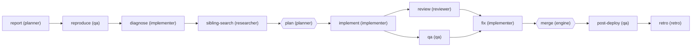
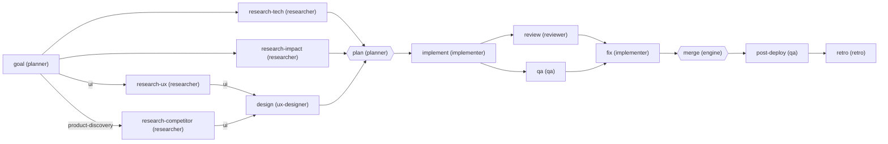
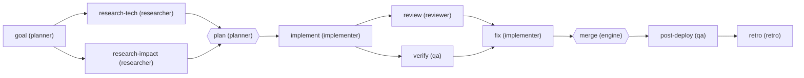
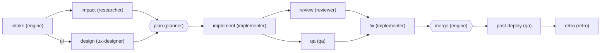
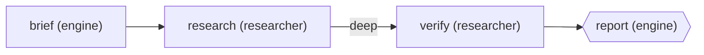

# Playbooks

Generated from `graphs/*.md` by `graph-control render --write`; `render --check` fails when this file drifts, so edit the graphs, not this file. A hexagon is a gate node (`gate: yes`); an edge label is the `when:` condition of the node it enters.

## [bug](../graphs/bug.md)

## [feature](../graphs/feature.md)

## [infra](../graphs/infra.md)

## [quick](../graphs/quick.md)

## [research](../graphs/research.md)

